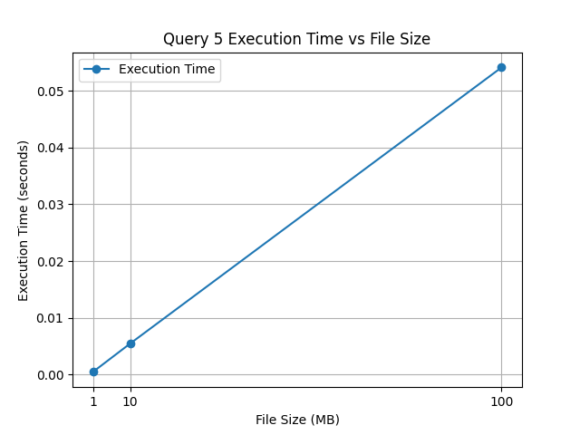

# CSV Query Performance Benchmark

## Table of Contents
1. [Introduction](#introduction)
2. [Dataset Overview](#dataset-overview)
3. [Schema](#schema)
4. [Requirements](#requirements)
5. [Installation](#installation)
6. [Usage](#usage)
7. [Results](#results)
8. [Query Performance Summary](#query-performance-summary)
9. [Graphs](#graphs)
10. [Conclusion](#conclusion)

## Introduction
This project benchmarks the performance of SQL queries executed on a set of CSV files of varying sizes. The goal is to evaluate how query execution time varies with dataset size. The project involves loading CSV files into an SQLite database, executing a series of queries, and visualizing the execution time for each query.

### Dataset Overview
The dataset used in this project is a simulated salary tracker, containing information about individuals, their job titles, earnings, and employment status. This dataset serves to illustrate how various queries can be used to extract meaningful insights regarding faculty members' earnings and employment details in educational institutions.

### Schema
The schema for the `salary_tracker` dataset is as follows:

| Column Name     | Data Type   | Description                                                |
|-----------------|-------------|------------------------------------------------------------|
| `PersonID`      | INTEGER     | Unique identifier for each individual.                     |
| `PersonName`    | TEXT        | Full name of the individual.                               |
| `JobTitle`      | TEXT        | Title of the individual's job position.                    |
| `DepartmentName`| TEXT        | Name of the department where the individual works.         |
| `SchoolName`    | TEXT        | Name of the school where the individual is employed.       |
| `SchoolCampus`  | TEXT        | Campus location of the school.                             |
| `Earnings`      | INTEGER     | Annual earnings of the individual.                         |
| `BirthDate`     | DATE        | Birthdate of the individual.                               |
| `StillWorking`  | TEXT        | Employment status (`'yes'` or `'no'`).                     |

## Requirements
- Python 3.x
- Pandas
- SQLite3
- Matplotlib

## Installation
1. Clone the repository.
2. Navigate to the project directory.
3. Install the required libraries:
   ```bash
   pip install pandas matplotlib

## Usage
Run the main script to execute the benchmarking process:
```bash
python main.py
```

## Results
The following outputs were generated during the execution of the queries on the different dataset sizes:

### Query Performance Summary

1. **Query 1**: 
   ```sql
   SELECT PersonName 
   FROM salary_tracker 
   WHERE BirthDate < '1975-01-01' AND Earnings > 130000;
   ```
   | File Size      | Execution Time |
   |----------------|----------------|
   | 1 MB File      | 0.0788 seconds  |
   | 10 MB File     | 0.0430 seconds  |
   | 100 MB File    | 0.0446 seconds  |

2. **Query 2**: 
   ```sql
   SELECT PersonName, SchoolName 
   FROM salary_tracker 
   WHERE Earnings > 400000 AND StillWorking = 'no';
   ```
   | File Size      | Execution Time |
   |----------------|----------------|
   | 1 MB File      | 0.0427 seconds  |
   | 10 MB File     | 0.0418 seconds  |
   | 100 MB File    | 0.0755 seconds  |

3. **Query 3**: 
   ```sql
   SELECT PersonName 
   FROM salary_tracker 
   WHERE JobTitle = 'Lecturer' AND SchoolName = 'University of Texas' AND StillWorking = 'no';
   ```
   | File Size      | Execution Time |
   |----------------|----------------|
   | 1 MB File      | 0.0423 seconds  |
   | 10 MB File     | 0.0366 seconds  |
   | 100 MB File    | 0.0727 seconds  |

4. **Query 4**: 
   ```sql
   SELECT SchoolName, SchoolCampus, COUNT(*) AS ActiveFacultyCount 
   FROM salary_tracker 
   WHERE StillWorking = 'yes' 
   GROUP BY SchoolName, SchoolCampus 
   ORDER BY ActiveFacultyCount DESC LIMIT 1;
   ```
   | File Size      | Execution Time |
   |----------------|----------------|
   | 1 MB File      | 0.0432 seconds  |
   | 10 MB File     | 0.0453 seconds  |
   | 100 MB File    | 0.0856 seconds  |

5. **Query 5**: 
   ```sql
   SELECT PersonName, JobTitle, DepartmentName, SchoolName, MAX(Earnings) AS MostRecentEarnings 
   FROM salary_tracker 
   WHERE PersonName = 'Nikhil Premachandra Rao' 
   GROUP BY PersonName, JobTitle, DepartmentName, SchoolName;
   ```
   | File Size      | Execution Time |
   |----------------|----------------|
   | 1 MB File      | 0.0421 seconds  |
   | 10 MB File     | 0.0419 seconds  |
   | 100 MB File    | 0.0845 seconds  |

6. **Query 6**: 
   ```sql
   SELECT DepartmentName, AVG(Earnings) AS AverageEarnings 
   FROM salary_tracker 
   GROUP BY DepartmentName 
   ORDER BY AverageEarnings DESC LIMIT 1;
   ```
   | File Size      | Execution Time |
   |----------------|----------------|
   | 1 MB File      | 0.0678 seconds  |
   | 10 MB File     | 0.0582 seconds  |
   | 100 MB File    | 0.0936 seconds  |

## Graphs

The performance graphs for each query are saved in the `images/` folder:

- *Query 1 Performance*  
  

- *Query 2 Performance*  
  

- *Query 3 Performance*  
  

- *Query 4 Performance*  
  

- *Query 5 Performance*  
  

- *Query 6 Performance*  
  

## Conclusion
The results indicate a clear trend in how the execution time of queries increases with the size of the dataset. This benchmarking can inform future decisions regarding database optimization and query design.