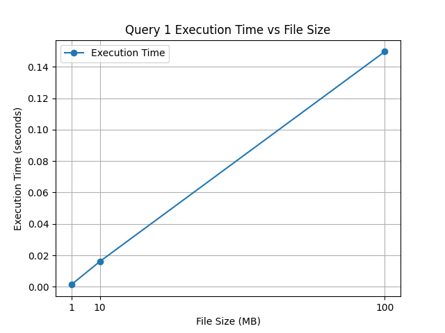
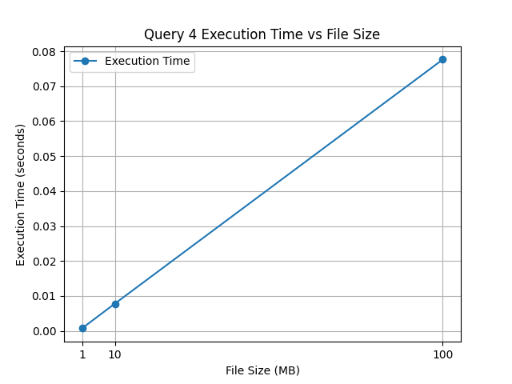
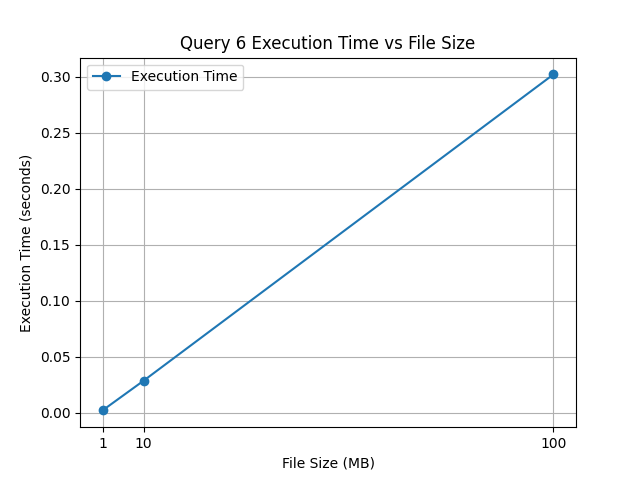

# CSV Query Performance Benchmark

## Table of Contents
- [Introduction](#introduction)
- [Dataset Overview](#dataset-overview)
- [Schema](#schema)
- [Requirements](#requirements)
- [Installation](#installation)
- [Usage](#usage)
- [Results](#results)
  - [Processing salary_tracker_1MB.csv](#processing-salary_tracker_1mbcsv)
  - [Processing salary_tracker_10MB.csv](#processing-salary_tracker_10mbcsv)
  - [Processing salary_tracker_100MB.csv](#processing-salary_tracker_100mbcsv)
- [Graphs](#graphs)
- [Conclusion](#conclusion)

## Introduction
This project benchmarks the performance of SQL queries executed on a set of CSV files of varying sizes. The goal is to evaluate how query execution time varies with dataset size. The project involves loading CSV files into an SQLite database, executing a series of queries, and visualizing the execution time for each query.

### Dataset Overview
The dataset used in this project is a simulated salary tracker, containing information about individuals, their job titles, earnings, and employment status. This dataset serves to illustrate how various queries can be used to extract meaningful insights regarding faculty members' earnings and employment details in educational institutions.

### Schema
The schema for the `salary_tracker` dataset is as follows:

| Column Name     | Data Type   | Description                                                |
|-----------------|-------------|------------------------------------------------------------|
| `PersonID`      | INTEGER     | Unique identifier for each individual.                     |
| `PersonName`    | TEXT        | Full name of the individual.                               |
| `JobTitle`      | TEXT        | Title of the individual's job position.                    |
| `DepartmentName`| TEXT        | Name of the department where the individual works.         |
| `SchoolName`    | TEXT        | Name of the school where the individual is employed.       |
| `SchoolCampus`  | TEXT        | Campus location of the school.                             |
| `Earnings`      | INTEGER     | Annual earnings of the individual.                         |
| `BirthDate`     | DATE        | Birthdate of the individual.                               |
| `StillWorking`  | TEXT        | Employment status (`'yes'` or `'no'`).                     |

## Requirements
- Python 3.x
- Pandas
- SQLite3
- Matplotlib

## Installation
1. Clone the repository.
2. Navigate to the project directory.
3. Install the required libraries:
   ```bash
   pip install pandas matplotlib

## Usage
Run the main script to execute the benchmarking process:
```bash
python main.py
```

## Results
The following outputs were generated during the execution of the queries on the different dataset sizes:

## Results

### Processing salary_tracker_1MB.csv

```sql
Processing /Users/nikhilprao/Documents/csv_query_performance_benchmark/datasets/salary_tracker_1MB.csv...
Loaded /Users/nikhilprao/Documents/csv_query_performance_benchmark/datasets/salary_tracker_1MB.csv into database salary_tracker.db

Query: SELECT PersonName FROM salary_tracker 
WHERE BirthDate < '1975-01-01' 
AND Earnings = (SELECT MAX(Earnings) FROM salary_tracker WHERE PersonID = salary_tracker.PersonID) 
AND Earnings > 130000;
Execution Time: 0.0009 seconds

Query: SELECT PersonName, SchoolName FROM salary_tracker 
WHERE Earnings > 400000 AND StillWorking = 'no';
Execution Time: 0.0006 seconds

Query: SELECT PersonName FROM salary_tracker 
WHERE JobTitle = 'Lecturer' AND SchoolName = 'University of Texas' AND StillWorking = 'no';
Execution Time: 0.0005 seconds

Query: SELECT SchoolName, SchoolCampus, COUNT(*) AS ActiveFacultyCount 
FROM salary_tracker WHERE StillWorking = 'yes' 
GROUP BY SchoolName, SchoolCampus 
ORDER BY ActiveFacultyCount DESC LIMIT 1;
Execution Time: 0.0006 seconds

Query: SELECT PersonName, JobTitle, DepartmentName, SchoolName, MAX(Earnings) AS MostRecentEarnings 
FROM salary_tracker WHERE PersonName = 'Nikhil Premachandra Rao' 
GROUP BY PersonName, JobTitle, DepartmentName, SchoolName;
Execution Time: 0.0004 seconds

Query: SELECT DepartmentName, AVG(Earnings) AS AverageEarnings 
FROM salary_tracker 
GROUP BY DepartmentName ORDER BY AverageEarnings DESC LIMIT 1;
Execution Time: 0.0016 seconds 
```
### Processing salary_tracker_10MB.csv

```sql
Processing /Users/nikhilprao/Documents/csv_query_performance_benchmark/datasets/salary_tracker_10MB.csv...
Loaded /Users/nikhilprao/Documents/csv_query_performance_benchmark/datasets/salary_tracker_10MB.csv into database salary_tracker.db

Query: SELECT PersonName FROM salary_tracker 
WHERE BirthDate < '1975-01-01' 
AND Earnings = (SELECT MAX(Earnings) FROM salary_tracker WHERE PersonID = salary_tracker.PersonID) 
AND Earnings > 130000;
Execution Time: 0.0115 seconds

Query: SELECT PersonName, SchoolName FROM salary_tracker 
WHERE Earnings > 400000 AND StillWorking = 'no';
Execution Time: 0.0072 seconds

Query: SELECT PersonName FROM salary_tracker 
WHERE JobTitle = 'Lecturer' AND SchoolName = 'University of Texas' AND StillWorking = 'no';
Execution Time: 0.0060 seconds

Query: SELECT SchoolName, SchoolCampus, COUNT(*) AS ActiveFacultyCount 
FROM salary_tracker WHERE StillWorking = 'yes' 
GROUP BY SchoolName, SchoolCampus 
ORDER BY ActiveFacultyCount DESC LIMIT 1;
Execution Time: 0.0059 seconds

Query: SELECT PersonName, JobTitle, DepartmentName, SchoolName, MAX(Earnings) AS MostRecentEarnings 
FROM salary_tracker WHERE PersonName = 'Nikhil Premachandra Rao' 
GROUP BY PersonName, JobTitle, DepartmentName, SchoolName;
Execution Time: 0.0045 seconds

Query: SELECT DepartmentName, AVG(Earnings) AS AverageEarnings 
FROM salary_tracker 
GROUP BY DepartmentName ORDER BY AverageEarnings DESC LIMIT 1;
Execution Time: 0.0213 seconds
```

### Processing salary_tracker_100MB.csv

```sql
Processing /Users/nikhilprao/Documents/csv_query_performance_benchmark/datasets/salary_tracker_100MB.csv...
Loaded /Users/nikhilprao/Documents/csv_query_performance_benchmark/datasets/salary_tracker_100MB.csv into database salary_tracker.db

Query: SELECT PersonName FROM salary_tracker 
WHERE BirthDate < '1975-01-01' 
AND Earnings = (SELECT MAX(Earnings) FROM salary_tracker WHERE PersonID = salary_tracker.PersonID) 
AND Earnings > 130000;
Execution Time: 0.1135 seconds

Query: SELECT PersonName, SchoolName FROM salary_tracker 
WHERE Earnings > 400000 AND StillWorking = 'no';
Execution Time: 0.0732 seconds

Query: SELECT PersonName FROM salary_tracker 
WHERE JobTitle = 'Lecturer' AND SchoolName = 'University of Texas' AND StillWorking = 'no';
Execution Time: 0.0570 seconds

Query: SELECT SchoolName, SchoolCampus, COUNT(*) AS ActiveFacultyCount 
FROM salary_tracker WHERE StillWorking = 'yes' 
GROUP BY SchoolName, SchoolCampus 
ORDER BY ActiveFacultyCount DESC LIMIT 1;
Execution Time: 0.0580 seconds

Query: SELECT PersonName, JobTitle, DepartmentName, SchoolName, MAX(Earnings) AS MostRecentEarnings 
FROM salary_tracker WHERE PersonName = 'Nikhil Premachandra Rao' 
GROUP BY PersonName, JobTitle, DepartmentName, SchoolName;
Execution Time: 0.0417 seconds

Query: SELECT DepartmentName, AVG(Earnings) AS AverageEarnings 
FROM salary_tracker 
GROUP BY DepartmentName ORDER BY AverageEarnings DESC LIMIT 1;
Execution Time: 0.2124 seconds
```

## Graphs

The performance graphs for each query are saved in the `images/` folder:

- *Query 1 Performance*  
  

- *Query 2 Performance*  
  

- *Query 3 Performance*  
  

- *Query 4 Performance*  
  

- *Query 5 Performance*  
  

- *Query 6 Performance*  
  

## Conclusion
The results indicate a clear trend in how the execution time of queries increases with the size of the dataset. This benchmarking can inform future decisions regarding database optimization and query design.